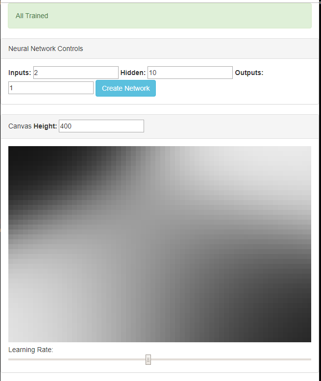

# p5js-nature-of-code-neural-network-xor-example-improved

#This is an improvement on the coding challenge (see link).

I added some UI controls to play with the parameters for the neural network.
Also, resizing the browser window adjusts the canvas.
Also, once it is trained, it stops training, and indicates so.
Also added one "throw" inside one of the project's methods, so that the error could be captured and explained.
The case is when you try to change the number of output layers to something other than "1", is an error because the training data "target" (expected output) is only a single value matrix, and so the output layer must also be a 1.

## original coding challenge video
https://www.youtube.com/watch?v=188B6k_F9jU

## (click image for demo video)

